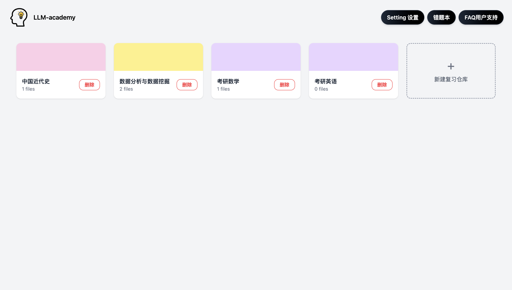
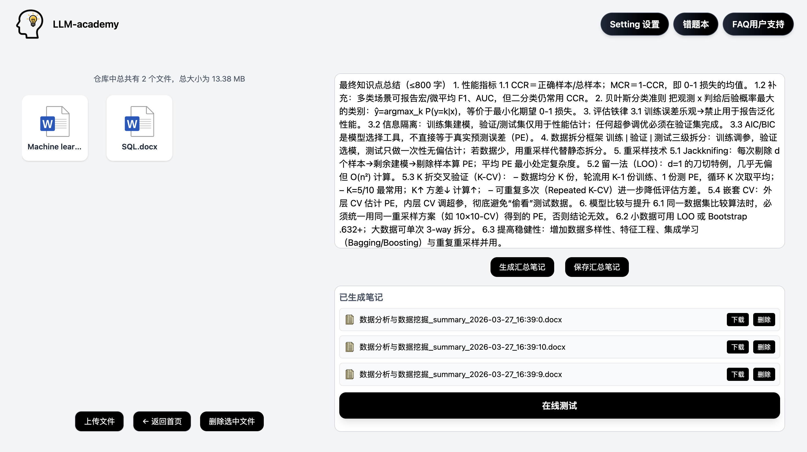
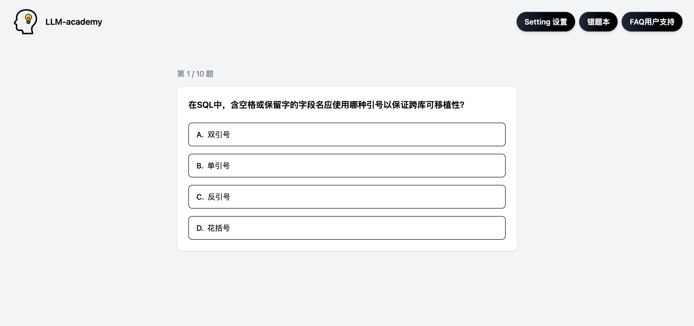
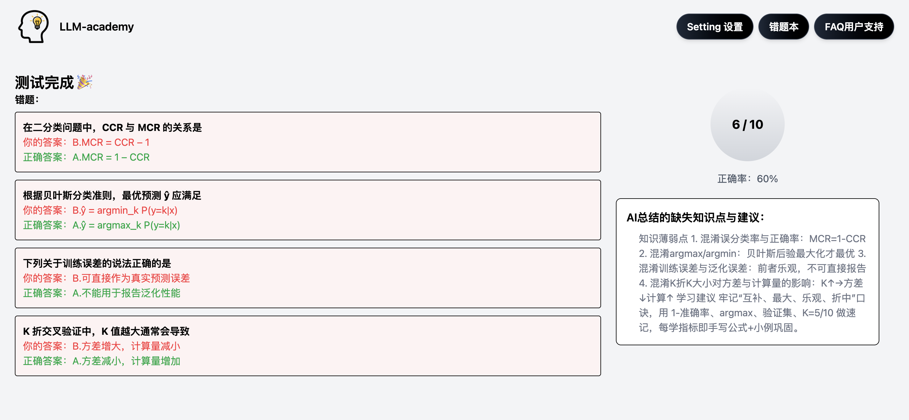
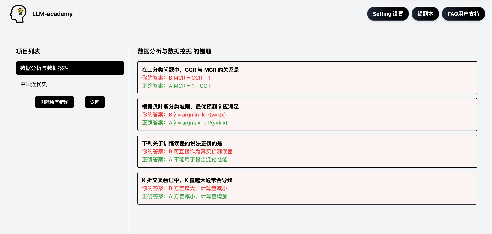
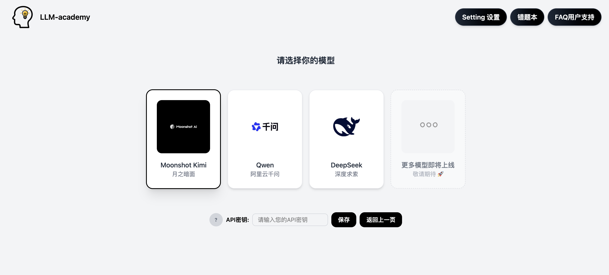

# LLM-Academy-SmartTutor (大模型导师）

 [](LICENSE) 

[中文](#中文-chinese) | [English](#english)

<a id="中文-chinese"></a>

# 中文介绍

> "当你即将要面对一些重要的考试或者重要的面试时，你是否曾会因为没有人帮你练习而担心自己的知识不够扎实？你是否曾会满网络找题库找面经，想方设法找那么一点点材料来当作自己的练习题呢“？


现在不担心了，**LLM-Academy-SmartTutor（大模型导师）** 是一款面向个人的 AI 智能导师。通过接入多家大模型服务，自动分析与总结你的学习资料，并生成个性化练习题库，帮助你系统性掌握知识。
无论是课件、课堂笔记还是教材内容，只要与你的学习相关，都可以交给 AI 进行整理与强化训练，让学习更加高效、精准。

## 支持模型与APIKey管理🔑

本应用目前支持的模型有Moonshot Kimi（月之暗面）、阿里云通义千问及Deepseek（深度求索），这三家服务商的模型用户可以通过API密钥直接接入。该应用的后端采用统一接口设计，实际上仅需极少改动即可扩展支持任意兼容 OpenAI API 协议的模型服务，后续将会对这一方面进行持续优化，直至可以适配更多其他企业的模型。
以下是能对能够支持模型的列举（资料参考于Kimi、阿里云、DeepSeek的开发者平台）

| 大模型服务提供商 | 可支持模型 | 应用内使用模型 |链接
|---------------|-----------|-----------------|---|
| Moonshot Kimi | Kimi-K2.5, Kimi-K2, Kimi-K2 Thinking,Kimi-K2-Turbo| Kimi-K2-Turbo | https://platform.moonshot.cn/
| 阿里云通义千问 | Qwen-3.5, Qwen-Plus，Qwen3-Max| Qwen-Plus | https://dashscope.aliyun.com/
| Deepseek | deepseek-chat | deepseek-chat | https://platform.deepseek.com/

#### 本项目会通过前端将你的 API 密钥传递至后端进行调用。请注意，API 密钥属于敏感信息，请妥善保管，避免泄露。
#### 本项目主要面向本地运行场景（如通过 GitHub clone 到本地使用），在未部署到公网服务器的情况下，API 密钥不会被暴露在公共网络中。但仍建议避免在不受信任的环境中使用或存储密钥。

## 部署方法

⏬ 首先先将项目克隆至本地，打开某个文件夹的终端

```bash
git clone https://github.com/Toby-IDev/LLM-Academy-SmartTutor.git
```

📂 进入项目目录

```bash
cd SmartTutor
```

💻 安装必要依赖

```bash
npm install
```

🚗 一键启动项目

```bash
npm run start
```

按照终端提示启动服务后，在浏览器中访问 http://localhost:5173 即可打开应用。

## 如果想单独对后端进行调试

可以在进入项目目录后再在终端输入，然后单独启动后端

```bash
cd smarttutorbackend
npm run start
```

## 主要页面演示

### 仓库页

仓库页是整个应用的首页和用户的项目页，用户可在此页新增项目及删除项目（项目即是用户想设置的复习单元）



### 主页

主页是用于上传课件、笔记等材料的主页，可生成AI精炼笔记及将笔记保存至本地。内有跳转至在线测试的按钮。



### 在线测试

在线测试页面。该页面出现的题目是由AI基于用户提供的课件笔记等材料生成的



### 在线测试后复盘

该页面与在线测试页面位于同一个组件，在完成所有在线测试题（现设置为10道）后即会弹出，左侧显示错题，右侧显示AI基于用户错题所给出的知识点复盘



### 错题本

该页面将展示用户自用本应用以来的所有错题，方便用户温习过去的错题内容



### API绑定页

该页面在菜单栏中可以直接跳转，为用户提供选择模型，保存API密钥的图形化接口



<a id="english"></a>

# Introduction

> "Have you ever felt unprepared before an important exam or interview because you didn’t have someone to practice with? Have you spent hours searching online for questions and materials, trying to piece together your own practice resources?"

No need to worry anymore.
LLM-Academy-SmartTutor is a personalized AI-powered tutor designed for individual learners. By integrating multiple large language model (LLM) services, it can automatically analyze and summarize your study materials, and generate customized practice questions to help you strengthen your knowledge systematically.

Whether it's slides, notes, or textbooks — as long as it's related to your learning, SmartTutor can process and transform it into efficient training content, making your study smarter and more effective.

## 🔑 Supported Models & API Key

This application currently supports the following model providers:

Moonshot Kimi
Alibaba Cloud Qwen (Tongyi Qianwen)
DeepSeek

Users can connect to these services using their own API keys.

The backend is designed with a unified interface, requiring only minimal modifications to support any model service compatible with the OpenAI API specification. Future updates will further improve compatibility with more providers.

| LLM Providers | Supported LLM Model  | Default Using Model| Link
|---------------|-----------|-----------------|---|
| Moonshot Kimi | Kimi-K2.5, Kimi-K2, Kimi-K2 Thinking,Kimi-K2-Turbo| Kimi-K2-Turbo | https://platform.moonshot.cn/
| Aliyun Qwen | Qwen-3.5, Qwen-Plus，Qwen3-Max| Qwen-Plus | https://dashscope.aliyun.com/
| Deepseek | deepseek-chat | deepseek-chat | https://platform.deepseek.com/

## ⚠️ Security Notice

This project sends your API key from the frontend to the backend for request processing.
Please note that API keys are sensitive credentials — keep them secure and avoid exposing them.

This project is primarily intended for local usage (e.g., cloning from GitHub and running locally).
When running locally, your API key will not be exposed to the public internet. However, if deployed to a public server, additional security measures are strongly recommended.

## 🚀 Getting Started

Clone the repository:

```bash
git clone https://github.com/Toby-IDev/LLM-Academy-SmartTutor.git
```

Navigate to the project directory:

```bash
cd SmartTutor
```

Install dependencies:

```bash
npm install
```

Start both frontend and backend (one-command startup):

```bash
npm run start
```

After starting the services, follow the terminal instructions and open:

```bash
http://localhost:5173
```

in your browser to access the application.

## 🔧 Backend Development (Optional)

If you want to run the backend separately:

```bash
cd smarttutorbackend
npm run start
```

## Demo

### Repository Page

The repository page serves as both the homepage of the entire application and the user’s project page. On this page, users can create and delete projects (a project refers to a review unit that the user wants to set up).


### MainPage

The homepage is used for uploading materials such as courseware and notes. It can generate AI-refined notes and allows users to save notes locally. It also includes a button that links to the online test section.


### Online Testing

The online test page displays questions generated by AI based on the course materials and notes provided by the user.


### Review Section After Online Testing

This page is part of the same component as the online test page. After completing all the test questions (currently set to 10), it will pop up automatically. The left side displays the incorrect questions, while the right side shows an AI-generated review of the key concepts based on the user’s mistakes.


### Wrong Questions Book

This page will display all the incorrect questions the user has accumulated since using the application, making it convenient for them to review previous
incorrect questions.


### API Linking Page

This page can be accessed directly from the menu bar and provides a graphical interface for users to select models and save their API keys.


